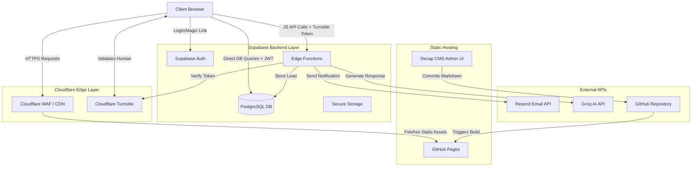

# System Design & Data Flow

## 1. High-Level System Diagram

The following diagram illustrates the relationship between the client browser, the edge network, the static host, and the backend services.

## 2. Component Workflows

### 2.1. Secure Inquiry System (Contact Form)
1. User navigates to `/contact`.
2. Cloudflare Turnstile widget verifies the user is human and generates a token.
3. User submits the form. JavaScript intercepts the submission.
4. JS sends a `POST` request containing the form data AND the Turnstile token to the `submit-inquiry` Supabase Edge Function.
5. **Security Check:** The Edge Function calls Cloudflare's API to verify the Turnstile token.
6. If valid, the Edge Function inserts the lead into the `inquiries` table.
7. The Edge Function calls the Resend API to email the site owner.
8. Edge Function returns a success response to the frontend.

### 2.2. Client Portal (Authentication & Data Retrieval)
1. Client visits `/portal`.
2. Client enters their email address.
3. Frontend uses `supabase.auth.signInWithOtp()` to request a magic link.
4. Supabase sends the magic link via email.
5. Client clicks the link and is redirected back to `/portal/dashboard` with a secure JWT.
6. Frontend JS uses `supabase.from('service_tickets').select('*')`.
7. **Security Check:** Supabase Postgres evaluates the Row Level Security (RLS) policy. It checks if the `client_id` on the rows matches the `sub` (subject/user ID) in the JWT.
8. Only the client's specific data is returned and rendered by the frontend.

### 2.3. AI Chatbot
1. User types a message in the chat widget.
2. JS sends the message to the `chat-assistant` Supabase Edge Function.
3. Edge Function injects a strict System Prompt (defining the AI's persona, knowledge of services, and limitations).
4. Edge Function calls the Groq LLM API.
5. Response is streamed back to the Edge Function, and then back to the client browser.

### 2.4. Content Management (Decap CMS)
1. Admin visits `/admin`.
2. Authenticates via GitHub OAuth.
3. Admin uses the React-based UI to write a blog post or add a portfolio item.
4. Clicking "Publish" commits a new `.md` file to the `content/blog/` directory in the GitHub repository.
5. GitHub Actions detects the push and runs the Hugo build process.
6. The updated static files are deployed to GitHub Pages.
